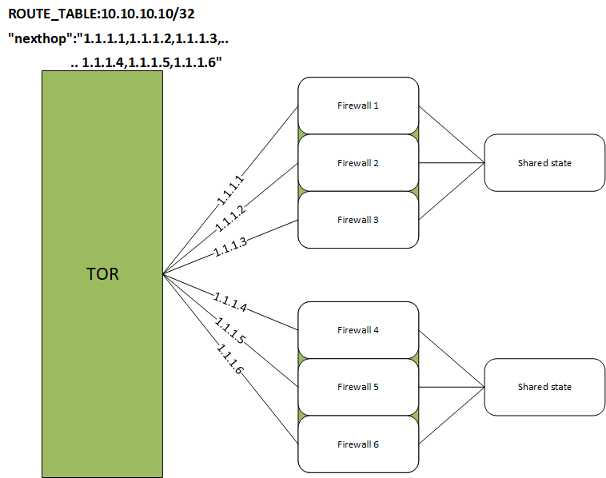
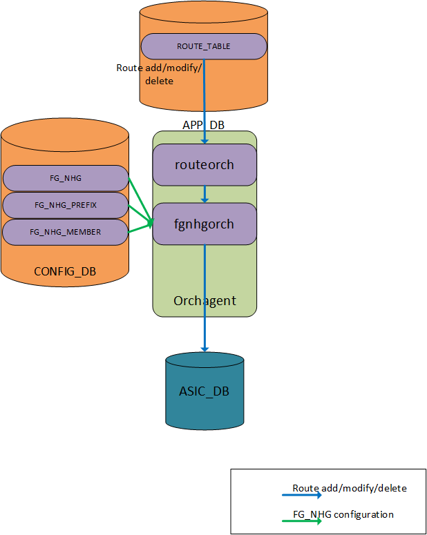
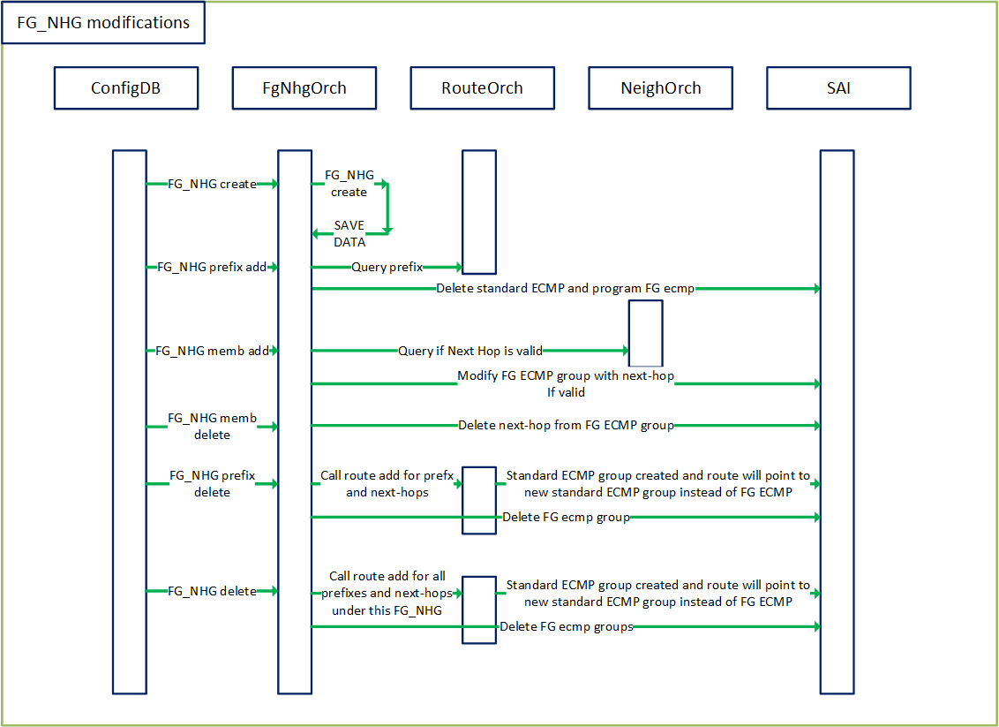
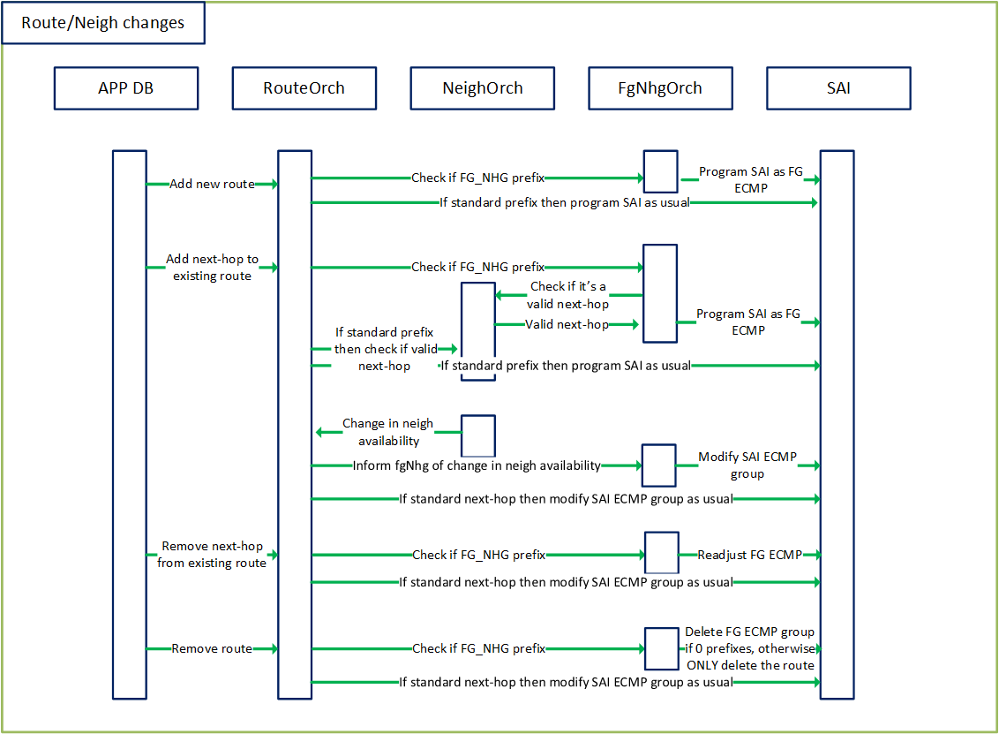
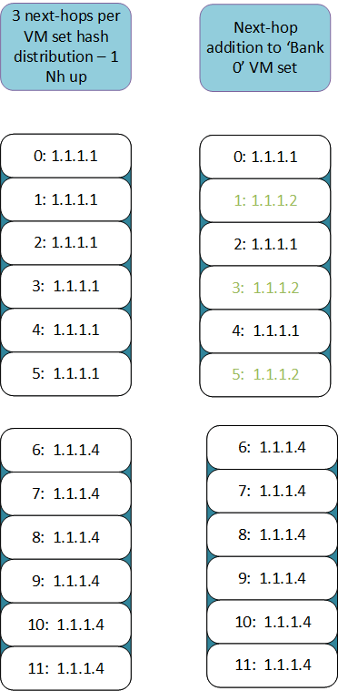
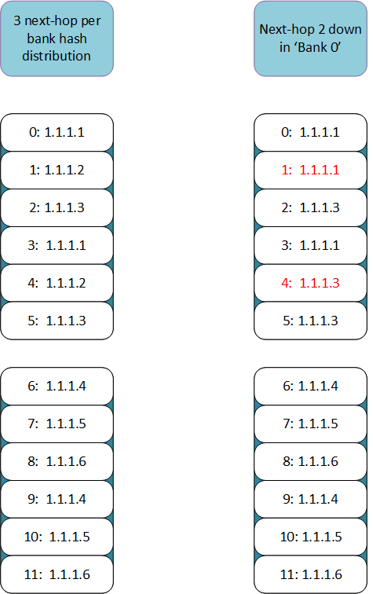
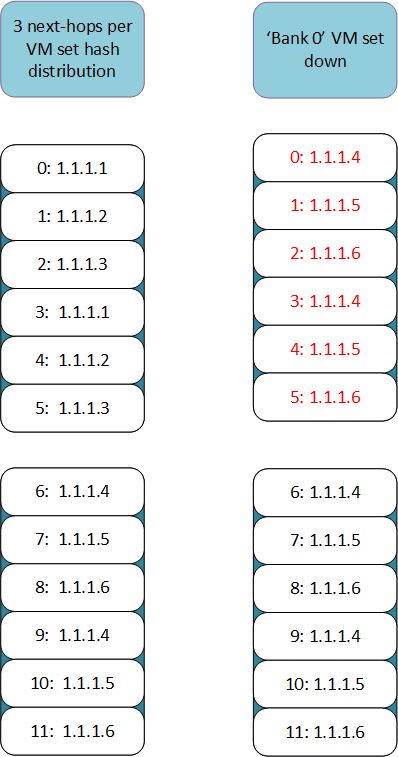
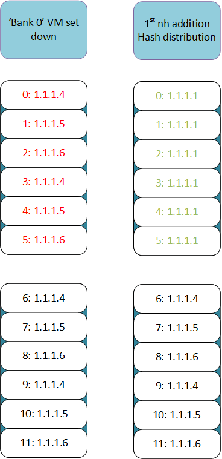

# SONiC Fine Grained ECMP 
# High Level Design Document
### Rev 0.1

# Table of Contents
  * [List of Tables](#list-of-tables)

  * [Revision](#revision)

  * [About this Manual](#about-this-manual)

  * [Scope](#scope)

  * [Use case](#use-case)

  * [Definitions/Abbreviation](#definitionsabbreviation)
 
  * [1 Requirements Overview](#1-requirements-overview)
    * [1.1 Functional requirements](#11-functional-requirements)
    * [1.2 Orchagent requirement](#12-orchagent-requirements)
    * [1.3 CLI requirements](#13-cli-requirements)
    * [1.4 Scalability requirements](#14-scalability-requirements)
    * [1.5 Warm Restart requirements ](#15-warm-restart-requirements)
  * [2 Modules Design](#2-modules-design)
    * [2.1 Config DB](#21-config-db)
    * [2.2 State DB](#22-state-db)
    * [2.3 CLI](#23-cli)
    * [2.4 Orchestration Agent](#24-orchestration-agent)
    * [2.5 SAI](#25-sai)
  * [3 Flows](#3-flows)
  * [4 Details](#4-details)
  * [5 Example configuration](#5-example-configuration)
  * [6 Warm boot support](#6-warm-boot-support)
  * [7 Test Plan](#7-test-plan)

###### Revision
| Rev |     Date    |       Author       | Change Description                |
|:---:|:-----------:|:------------------:|-----------------------------------|
| 0.1 | 04/24/2020  |    Anish Narsian   | Initial version                   |
| 1.0 | 05/22/2020  |    Anish Narsian   | Incorporated review comments      |


# About this Manual
This document provides the high level design for the Fine Grained ECMP feature implementation in SONiC
Associated SAI proposal: https://github.com/opencomputeproject/SAI/blob/master/doc/ECMP/Ordered_and_Fine_Grained_ECMP.md
# Scope
This document describes the high level design of a staic Fine Grained ECMP feature as implemented in the application layer. 
- In-scope: Modifying the behavior of ECMP to achieve fine grained handling of ECMP for a specifically identified prefix and associated next-hops in configuration
- Out of scope: Dynamic ways to enable and use fine grained ECMP in a way that enables consistent ECMP for all possible prefixes
# Use case


Firewall or other applications running on loadbalanced VMs which maintain state of flows running through them, such that:
- There is shared state amongst some set of firewalls so that flows can be recovered if a flow transistions from 1 firewall to another in the same firewall set(bank). Flow transistions can occur when next-hops are added/withdrawn. In this example Firewall 1,2,3 form a firewall set(bank)
- Flow recovery is expensive so we should limit the flow redistributions which occur during next-hop addition and removal
- Given that not all firewalls share state, there is a need to redistribute flows only amongst the firewalls which share state
- An entire firewall set can go down


# Definitions/Abbreviation
###### Table 1: Abbreviations
| Abbreviation             | Meaning                        |
|--------------------------|--------------------------------|
| ECMP                     | Equal Cost MultiPath           |
| FG                       | Fine Grained                   |
| NHG                      | Next Hop Group                 |


# 1 Requirements Overview
## 1.1 Functional requirements
This section describes the SONiC requirements for Fine Grained ECMP next-hop groups 

At a high level the following should be supported:

Phase #1
- Should be able to configure a Fine Grained ECMP group which defines a static means of redistribution of ECMP upon next-hop modifications based upon the fine grained ECMP SAI proposal
- Standard route modifications should enable special ECMP behavior for those prefixes which desire Fine Grained ECMP. For all other prefixes the standard ECMP behavior should apply. 
- Ability to enable consistent hashing via Fine grained ECMP for a statically defined ECMP group
- Ability to specify a group(bank) in which ECMP redistribution should be performed out of a set of available next-hops
- Warm restart support

Phase #2
- CLI commands to configure Fine Grained ECMP

Future Requirements:
- Current implementation uses prefix to trigger fine grained ECMP functionality. If there are future use case requirements where next-hop based triggers for fine grained ECMP functionality are desired then a FG_NHG "mode" will be added into the CONFIG_DB schema. The "mode" value would either be "prefix" or "next-hop" and will drive the trigger for ECMP functionality. 


## 1.2 Orchagent requirements
### FgNhg orchagent:
 - Should be able to create Fine Grained Next-hop groups
 - Should be able to control ECMP for a prefix in the special way as defined in next-hop group definitions
 - Should continue to be compatible with existing routeorch functionality

### Route orchagent:
 - Should be able to redirect route and next-hop modifications to fgNhg orchagent for prefixes which have a Fine Grained definition
 
## 1.3 CLI requirements
- User should be able to add/delete/view Fine Grained Next-hop groups
- User should be able to view the configured state of fine grained groups

## 1.4 Scalability requirements

### 1.4.1 Fine Grained Next-hop group
###### Table 2: Scalability
| Component                | Expected value              |
|--------------------------|-----------------------------|
| Size of hash bucket      | HW specific(can be 4k)      |
| Number of FG ECMP groups | 8                           |


## 1.5 Warm Restart requirements
Warm restart is required for this design since the solution would benefit from having non-disruptive reboot and upgrades.

# 2 Modules Design

## 2.1 Config DB
Following new tables will be added to Config DB. Unless otherwise stated, the attributes are mandatory.
```
FG_NHG|{{fg-nhg-group-name}}:
    "bucket_size": {{hash_bucket_size}}

FG_NHG_PREFIX|{{IPv4 OR IPv6 prefix}}:
    "FG_NHG":{{fg-nhg-group-name}}

FG_NHG_MEMBER|{{next-hop-ip(IPv4 or IPv6 address)}}:
    "FG_NHG":{{fg-nhg-group-name}}
    "Bank": {{an index which specifies a bank/group in which the redistribution is performed}} 
```


### 2.1.1 ConfigDB Schemas
```
; Defines schema for FG NHG configuration attributes
key                                   = FG_NHG|fg-nhg-group-name      ; FG_NHG group name
; field                               = value
BUCKET_SIZE                           = hash_bucket_size              ; total hash bucket size desired, recommended value of Lowest Common Multiple of 1..{max # of next-hops}
		  
```

```
; Defines schema for FG NHG prefix configuration attributes
key                                   = FG_NHG_PREFIX|{{IPv4 OR IPv6 prefix}} ; FG_NHG_PREFIX for which FG behavior is desired
; field                               = value
FG_NHG                                = fg-nhg-group-name                     ; Fine Grained next-hop group name
```

```
; Defines schema for FG NHG member configuration attributes
key                                   = FG_NHG_MEMBER|{{next-hop-ip(IPv4 or IPv6 address)}}    ; FG_NHG next-hop-ip member associated with prefix
; field                               = value
FG_NHG                                = fg-nhg-group-name                                      ; Fine Grained next-hop group name
BANK                                  = DIGITS                                                 ; An index which specifies a bank/group in which the redistribution is performed
```

Please refer to the [schema](https://github.com/Azure/sonic-swss/blob/master/doc/swss-schema.md) document for details on value annotations. 


## 2.2 State DB
Following new table will be added to State DB. Unless otherwise stated, the attributes are mandatory.
FG_ROUTE_TABLE is used for some of the show commands associated with this feature as well as for warm boot support.
```
FG_ROUTE_TABLE|{{IPv4 OR IPv6 prefix}}:
    "0": {{next-hop-key}}
    "1": {{next-hop-key}}
    ...
    "{{hash_bucket_size -1}}": {{next-hop-key}}
```


### 2.2.1 StateDB Schemas
```
; Defines schema for FG ROUTE TABLE state db attributes
key                                   = FG_ROUTE_TABLE|{{IPv4 OR IPv6 prefix}}      ; Prefix associated with this route
; field                               = value
INDEX                                 = next-hop-key                                ; index in hash bucket associated with the next-hop-key(IP addr,if alias) 
```


## 2.3 CLI

Commands summary (Phase #2):
CLI commands:
```
	config fg nhg <add/del> <fg-nhg-group-name> type <static/dynamic> size <hash_bucket_size>
	config fg nhg prefix <add/del> <fg-nhg-group-name> <prefix>
	config fg nhg member <add/del> <fg-nhg-group-name>  <next-hop-ip>
	show fg nhg group <fg-nhg-group-name/all>
	show fg nhg hash-view <fg-nhg-group-name> (shows the current hash bucket view of fg nhg)
	show fg nhg active-hops <fg-nhg-group-name> (shows which set of next-hops are active) 
```

Show CLI commands of ```show fg nhg hash-view``` and ```show fg nhg active-hops``` are implemented as a view of the state db table described in section 2.2


## 2.4 Orchestration Agent
Following orchagents shall be modified. Flow diagrams are captured in a later section. 
- routeorch
- fgnhgorch

 ### routeorch
 This is the swss orchetrator responsible for pushing routes down to the ASIC. It creates ECMP groups in the ASIC for cases where there are multiple next-hops. It also adds/removes next-hop members as neighbor availability changes(link up and down scnearios). It will evoke fgnhgorch for all prefixes which desire special ecmp behavior.
 	
 ### fgnhgorch
 This is the swss orchestrator which receives FG_NHG entries and identifies the exact way in which the hash buckets need to be created and assigned at the time of BGP route modifications. For BGP route modifications/next-hop changes, fgnhgorch gets evoked by routeorch. It creates ecmp groups with the new SAI components in Table 3 and will be the orchestrator responsible for achieving the use cases highlighted above by modifying hash buckets in a special manner.
 

 
The overall data flow diagram is captured in Section 3 for all TABLE updates. 
Refer to section 4 for detailed information about redistribution performed during runtime scenarios. 

 
## 2.5 SAI
The below table represents main SAI attributes which shall be used for Fine Grained ECMP


###### Table 3: Fine Grained ECMP SAI attributes
| FG_NHG component         | SAI attribute                                         |
|--------------------------|-------------------------------------------------------|
| Fine Grained ECMP type   | SAI_NEXT_HOP_GROUP_TYPE_FINE_GRAIN_ECMP               |
| Configured group size    | SAI_NEXT_HOP_GROUP_ATTR_CONFIGURED_SIZE               |
| Real group size          | SAI_NEXT_HOP_GROUP_ATTR_REAL_SIZE                     |
| Next-hop ids             | SAI_NEXT_HOP_GROUP_MEMBER_ATTR_NEXT_HOP_ID            |
| Specify nh index         | SAI_NEXT_HOP_GROUP_MEMBER_ATTR_INDEX                  |


# 3 Flows




# 4 Details
- A key idea in achieving consistent ecmp and limiting redistributions to a bank(group) is the creation of many hash buckets(SAI_OBJECT_TYPE_NEXT_HOP_GROUP_MEMBER) associated with an ecmp group and having a next-hop repeated multiple times within it. 
- Now if a next-hop were to go down we would only change the hash buckets which are affected by the next-hop down event. This allows us to ensure that all flows are not affected by a next-hop change, thereby achieving consistent hashing
- Further, by pushing configuration with next-hop bank membership, we can ensure that we only refill the affected hash buckets with those next-hops within the same bank. Thus achieving consistent hashing within a bank itself and meeting the requirement/use case above.  
- A distiction is made between Kernel routes and hardware routes for fine grained ECMP. The kernel route contains the prefix along with standard next-hops as learnt via BGP or any other means. Fine Grained ECMP takes that standard route(as pushed via APP DB + routeorch) and then creates a fine grained ECMP group by expanding it into the hash bucket membership. Further the kernel route and hw route are not equivalent due to the special redistribution behavior with respect to the bank defintion. Special logic is also present to ensure that any next-hops which don't match the static FG_NHG next-hop set for a prefix will cause the next-hop to be ignored to maintain consistency with the desired hw route and hashing state defined in FG_NHG. FG_NHG drives the final state of next-hop groups in the ASIC given a user programs the config_db entry for it.
- Given that fgnhgorch can ignore next-hops in route addition in order to maintain consistency with FG_NHG, special syslog error messages will be displayed whenever fgnhgorch skips propagation of a next-hop to the ASIC.
- A guideline for the hash bucket size is to define a bucket size which will allow equal distribution of traffic regardless of the number of next-hops which are active. For example with 2 Firewall sets, each set containing 3 firewall members: each set can have equal redistribution by finding the lowest common multiple of 3 next-hops which is 3*2*1(this is equivalent to us saying that if there were 3 or 2 or 1 next-hop active, we could distribute the traffic equally amongst the next-hops). With 2 such sets we get a total of 3*2*1 + 3*2*1 = 12 hash buckets.

# 5 Example configuration

### Loadbalanced firewall sets
6 Firewalls where each set of 3 firewalls form a group which share state, advertising VIP 10.10.10.10:
- Firewall VM set 1 next-hops: 1.1.1.1, 1.1.1.2, 1.1.1.3
- Firewall VM set 2 next-hops: 1.1.1.4, 1.1.1.5, 1.1.1.6	

### ConfigDB objects:
```
{
	"FG_NHG": {
		"2-VM-Sets": {
			"hash_bucket_size": 12
		}
	},
	"FG_NHG_PREFIX": {
		"10.10.10.10/32": {
			"FG_NHG": "2-VM-Sets"
		}
	},
	"FG_NHG_MEMBER": {
		"1.1.1.1": {
			"FG_NHG": "2-VM-Sets",
			"Bank": 0
		},
		"1.1.1.2": {
			"FG_NHG": "2-VM-Sets",
			"Bank": 0
		},
		"1.1.1.3": {
			"FG_NHG": "2-VM-Sets",
			"Bank": 0
		},
		"1.1.1.4": {
			"FG_NHG": "2-VM-Sets",
			"Bank": 1
		},
		"1.1.1.5": {
			"FG_NHG": "2-VM-Sets",
			"Bank": 1
		},
		"1.1.1.6": {
			"FG_NHG": "2-VM-Sets",
			"Bank": 1
		}
	}
}
```

### Sample scenario which highlights redistribution performed by fgNhgOrch during runtime scenarios:
- Next-hop additions:



- Next-hop withdrawal:



- Entire VM/Firewall set down:



- First next-hop addition in set:



# 6 Warm boot support
The following state is maintained for warm boot support and updated during regular runtime of fgNhgOrch:
- State DB table FG_ROUTE_TABLE which maps the set of hash buckets to its associated next-hop member

FG_ROUTE_TABLE is persisted via an updated fast-reboot script

Warm boot requires special handling for fgNhgOrch since sequence of next-hop additions/modifictions lead to a non-deterministic state of fine grained membership indices in the ASIC, which we must recover in some way from persisted data. The saved mapping allows us to create ECMP groups identically during/after warm reboot.

Warm boot works as follows:
- Route addition gets pushed via the regular notification channel of APP DB
- routeorch gets called for the route in APP_DB, which in turn calls fgNhgOrch
- fgNhgOrch checks if this is a warm_boot scenario, if so, it queries FG_ROUTE_TABLE in state db and populates local structures of prefixes with special handling
- If this is a prefix which requires special handling then further local structures are re-populated based on FG_ROUTE_TABLE and we create SAI ECMP groups and members based on mapping from FG_ROUTE_TABLE given that the next-hops are identical(we expect that this is the case since warm reboot should not cause a change in APP_DB routes during warm reboot)
- If this is a non FG prefix then it continues to go through the regular routeorch processing
- We receive config_db entries for FG_NHG* entries at some point and we update the local structure accordingly 
- BGP comes up and any delta configuration gets pushed for routes and these go through the regular routeorch/fine grained behavior as usual

# 7 Test Plan
The following testing is planned for this feature:
- SWSS unit tests via virtual switch testing
- Data Plane tests via pytest + PTF

## SWSS unit tests via virtual switch testing
Will test config_db entry creation/deletion along with dynamic changes in APP_DB route entry. The test will check if the ASIC_DB state matches the expected hash bucket state upon the dynamic change in APP_DB route.

Tests:
- Create config_db entry with 2 banks, 3 members per bank
- Create 6 interfaces with IPs, and program an APP_DB route with IP prefix + 6 next-hops matching above config_db entry: check if hash buckets are created as expected adhereing to the bank defintions
- APP_DB route modified to reduce some number of next-hops: check if ASIC_DB hash bucket members show that the swss code maintains layered and consistent hashing
- APP_DB route modified to remove all next-hops in bank0: check if ASIC_DB hash bucket members show that members of bank1 take the place bank0 members
- APP_DB route modified to add 1st next-hop to bank0: check if ASIC_DB hash bucket members show that the added next-hop member takes up all the hash buckets assigened to the bank0
- Test both IPv4 and IPv6 above
- Test dynamic changes to the config_db bank + member defintion

## Data Plane tests via pytest + PTF
- Create config_db entry with 2 banks, 3 members per bank and deploy to DUT
- Create 6 IP endpoints on PTF host and set it up with arp responder
- Create an interface on the DUT which can interact with the above IP endpoints, each endpoint created above should be on a different physical interface
- Create an APP_DB entry with with 6 IPs as the next-hop, and some unique IP prefix, deploy it to the DUT
- Send, via PTF, about 100 unique flows from the T1 interface destined to the unique IP prefix
- Track which link receives which flow and store the mapping of flow to link
- Change the DUT APP_DB route to reduce 1 next-hop, validate that hash redistribution occured in the same bank and occured in a consistent fashion
- Change the DUT APP_DB route to have all next-hops in a bank0 as down, make sure that the traffic now flows to links in bank1 only
- Change the DUT APP_DB route to add 1st next-hop in a previously down bank0, now all the flows for bank0 should go to the 1 next-hop just added
- Test both IPv4 and IPv6 above
- (Stretch goal) Validate that in all cases the hash redistribution is roughly equal
